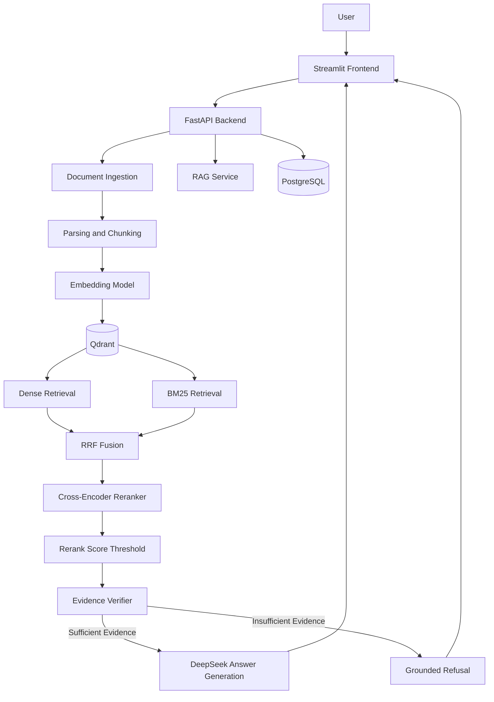

# RAG Knowledge Platform

An end-to-end, evaluation-driven Retrieval-Augmented Generation (RAG) platform featuring hybrid retrieval, cross-encoder reranking, evidence verification, and grounded question answering.

## Overview

RAG Knowledge Platform allows users to upload documents, build a searchable knowledge base, and ask questions with verifiable source citations.

The platform is designed to reduce unsupported LLM responses by combining retrieval relevance scoring with explicit evidence verification.

## Key Features

- **Document Ingestion:** Upload PDF, TXT, and Markdown files with automatic parsing and chunking.
- **Vector Search:** Semantic retrieval using Sentence Transformers and Qdrant.
- **Hybrid Retrieval:** Combine dense retrieval and BM25 using Reciprocal Rank Fusion (RRF).
- **Cross-Encoder Reranking:** Improve candidate ranking using a cross-encoder model.
- **Evidence Verification:** Check whether retrieved context contains sufficient evidence before generating an answer.
- **Grounded Answers:** Generate answers based on retrieved context with document and page citations.
- **Document Filtering:** Search across all documents or restrict retrieval to a selected document.
- **Query History:** Store question-answer records in PostgreSQL.
- **Web Interface:** Streamlit UI with document selection and chat history.
- **Docker Deployment:** Run the application using Docker Compose.

## Tech Stack

| Category | Technologies |
|---|---|
| Language | Python 3.13 |
| Backend | FastAPI, Pydantic |
| Frontend | Streamlit |
| LLM | DeepSeek API |
| Embeddings | Sentence Transformers, all-MiniLM-L6-v2 |
| Vector Database | Qdrant |
| Relational Database | PostgreSQL, SQLAlchemy |
| Retrieval | Dense Search, BM25, RRF |
| Reranking | Cross-Encoder |
| Testing | pytest |
| Deployment | Docker, Docker Compose |

## System Architecture



## Quick Start with Docker

### Prerequisites

- Git
- Docker Desktop with Docker Compose
- A valid DeepSeek API key

### 1. Clone the Repository

```bash
git clone https://github.com/jingbaizhang8-max/rag-knowledge-platform.git
cd rag-knowledge-platform
```

### 2. Configure Environment Variables

Copy the example environment file:

```bash
cp .env.example .env
```

On Windows PowerShell, use:

```powershell
Copy-Item .env.example .env
```

Edit `.env` and configure:

- `DEEPSEEK_API_KEY`: Your DeepSeek API key
- `POSTGRES_PASSWORD`: A secure PostgreSQL password

The remaining settings can use the provided defaults.

Do not commit `.env` to Git.

### 3. Start All Services

Make sure Docker Desktop is running.

```bash
docker compose up -d --build
```

Docker Compose starts four services:

- PostgreSQL
- Qdrant
- FastAPI backend
- Streamlit frontend

On first startup, downloading Python dependencies and embedding models may take several minutes.

### 4. Open the Application

Streamlit Web UI:

http://localhost:8501

FastAPI Swagger Documentation:

http://localhost:8000/docs

### 5. Usage

1. Upload a PDF, TXT, or Markdown document.
2. Wait for document indexing to complete.
3. Select a document or choose "All Documents".
4. Enter a question about the knowledge base.
5. View the generated answer and its source citations.
6. Use "Clear Conversation" to reset the current chat.

### 6. View Logs

```bash
docker compose logs -f api
```

### 7. Stop the Application

```bash
docker compose down
```

Docker named volumes preserve PostgreSQL, Qdrant, and uploaded document data between normal restarts.

Note: `docker compose down -v` also removes the project's named volumes and should only be used when intentionally resetting persistent data.


## Evaluation Results

The platform was evaluated on a custom 14-case dataset containing 8 answerable questions and 6 unanswerable questions, including paraphrased queries, out-of-domain questions, and hard negatives.

### Retrieval Performance

Retrieval was evaluated using Hit@3 and Mean Reciprocal Rank (MRR).

| Retrieval Method | Hit@3 | MRR |
|---|---:|---:|
| Dense Retrieval | 1.000 | 0.9375 |
| Hybrid Retrieval (Dense + BM25 + RRF) | 1.000 | 1.000 |
| Hybrid + Cross-Encoder Reranking | 1.000 | 1.000 |

Hybrid retrieval improved MRR from 0.9375 to 1.000 on the evaluation set. The reranker did not improve the aggregate metrics further on this small dataset, although it changed candidate rankings in individual queries.

### Answerability Evaluation

A reranking threshold alone cannot reliably determine whether retrieved context contains enough evidence to answer a question.

To address this, the platform includes an LLM-based Evidence Verifier that checks whether the retrieved context explicitly supports the requested answer.

| Configuration | Accuracy | False Positives | False Negatives |
|---|---:|---:|---:|
| Rerank Threshold (-2.0) | 92.9% | 1 | 0 |
| Threshold + Evidence Verifier | 100.0% | 0 | 0 |

The final pipeline correctly classified all 14 questions in the current evaluation set.

**Limitation:** These results are measured on a small, project-specific evaluation dataset and should not be interpreted as general production accuracy. Larger and more diverse datasets are needed for stronger conclusions.

### Key Findings

- Hybrid retrieval improved the ranking of relevant document chunks.
- Cross-encoder relevance scores alone are insufficient to determine answerability.
- A relaxed reranking threshold reduced false negatives in the tested cases.
- Evidence verification prevented unsupported answers to hard-negative questions.
- The platform returns a grounded refusal when sufficient supporting evidence is unavailable.

For detailed experiments and threshold analysis, see [Evaluation Results](evaluation/results.md).
